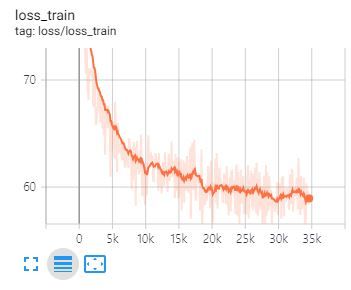

# CHAR-RNN

- Reimplement rnn-based character language model (CHAR-RNN) inspired by [Karpathy's blog](http://karpathy.github.io/2015/05/21/rnn-effectiveness/) using pytorch.
- Reimplement vanilia RNN and GRU as well.
- The data used for training is the works of Shakespeare.

## Requirements
- pytorch 1.1.0
- tqdm
- tensorboardX

## Train
```bash
python main.py --learning_rate 0.002\
    --seq_length 50\
    --epoch 100\
    --batch 64\
    --hidden_size 256\
    --rnn gru\
    --sampling sample
```
Plot train_loss and val_loss via TensorboardX.


## Result

~~~
clown:
one florance, i am for meet,
i shall it not verbided, a mad;
nuth, sir, for post thy advertis: make quite
tribunes:
take honourable commission: tell sprayk aboutly.
by many lipprame him; how i too.

rivers:
go several, gaves to the top to too?
i would plantagenetions as you
in twenty tongue and love;
no four right of my first custom for my sword, and she
he knows not yet.

first citizen:
we have but let him up.
but fetch a thousand abqua
~~~

